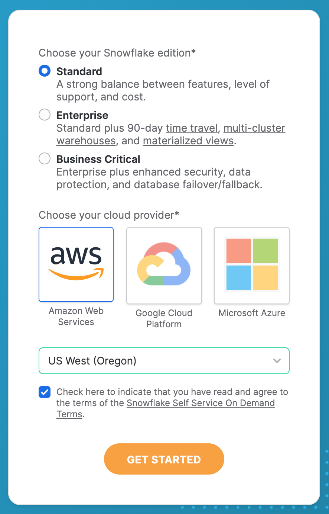

# Homework 2

## Objectives:
  -  Practice using a modern cloud database system (and understand why companies pay so much for the service).

## Assigned date:
  - April 18, 2021

## Due date:
  - April 27, 2021

## Assignment tools:
  - <a href="https://signup.snowflake.com/?trial=student">Snowflake</a>!
  - <a href="https://zwa06188.snowflakecomputing.com/">~~Our course Snowflake~~ cluster</a> **Don't use: obsolete**

## What to turn in:
You will turn in:
  - SQL for the queries
  - Runtimes for each query, along with the minimum, maximum, and average
  - Number of rows returned
  - First two rows from the result set (or all rows if a query returns fewer than 2 rows) 
  - A brief discussion of the differnt runtimes that you observed across the queries

Submit all 5 queries in a file called `solution.sql` and the written responses in a separate PDF file called `answers.pdf`.

## How to submit the assignment:

In your GitLab repository you should see a directory called `hw/hw2/submission/`. Put your report in that directory. Remember to commit and push your report to GitLab (`git add && git commit && git push`)!

# Assignment Details

In this Assignment you will be required to work with Snowflake on AWS using a mini-cluster, ingest data, and run some queries on this data.

## 1. Setting up your Snowflake account (0 points)
  - Activate your Snowflake account by going <a href="https://signup.snowflake.com/?trial=student">here</a>
    - Use @uw.edu email
    - Set company to "University of Washington Student"

  

  

  - You should recieve an account activation email; follow the prompt
  <!-- - IMPORTANT: ensure that that correct role -- named "[Your UW NetID]Role" -- is shown in the upper-righthand corner of the Snowflake console.  Let us know on edstem/email if you do not see it (or are in the "Public" role)  -->
  - Optional: follow the "Getting Started" tutorial and familiarize yourself with the Snowflake interface

## 2. Create a new database (0 points)
  - Using the console:
    - Click the databases link
    - Click "Create..."
    - Give your database a _unique_ name
    - Select "Finish"
  - Using a worksheet
    - Click the "Worksheets" link
    - Execute the SQL query `CREATE DATABASE [Your UW NetID]_myawesomedatabase;`

## 3. Ingest data (15 points)
  We'll be using the TPC-H datasets.  We'll import data from a separate database that we've set up in Snowflake.

  First we'll need to create tables.  We can use the following statements to create tables our tables in Snowflake.  Use the worksheets tab to submit these queries, and remember that you can submit multiple statements at once.

```sql
DROP TABLE IF EXISTS customer;
CREATE TABLE customer(
C_CustKey int ,
C_Name varchar(64) ,
C_Address varchar(64) ,
C_NationKey int ,
C_Phone varchar(64) ,
C_AcctBal decimal(13, 2) ,
C_MktSegment varchar(64) ,
C_Comment varchar(120)
);

DROP TABLE IF EXISTS lineitem;
CREATE TABLE lineitem(
L_OrderKey int ,
L_PartKey int ,
L_SuppKey int ,
L_LineNumber int ,
L_Quantity int ,
L_ExtendedPrice decimal(13, 2) ,
L_Discount decimal(13, 2) ,
L_Tax decimal(13, 2) ,
L_ReturnFlag varchar(64) ,
L_LineStatus varchar(64) ,
L_ShipDate datetime ,
L_CommitDate datetime ,
L_ReceiptDate datetime ,
L_ShipInstruct varchar(64) ,
L_ShipMode varchar(64) ,
L_Comment varchar(64)
);

DROP TABLE IF EXISTS nation;
CREATE TABLE nation(
N_NationKey int ,
N_Name varchar(64) ,
N_RegionKey int ,
N_Comment varchar(160)
);

DROP TABLE IF EXISTS orders;
CREATE TABLE orders(
O_OrderKey int ,
O_CustKey int ,
O_OrderStatus varchar(64) ,
O_TotalPrice decimal(13, 2) ,
O_OrderDate datetime ,
O_OrderPriority varchar(15) ,
O_Clerk varchar(64) ,
O_ShipPriority int ,
O_Comment varchar(80)
);

DROP TABLE IF EXISTS part;
CREATE TABLE part(
P_PartKey int ,
P_Name varchar(64) ,
P_Mfgr varchar(64) ,
P_Brand varchar(64) ,
P_Type varchar(64) ,
P_Size int ,
P_Container varchar(64) ,
P_RetailPrice decimal(13, 2) ,
P_Comment varchar(64)
);

DROP TABLE IF EXISTS partsupp;
CREATE TABLE partsupp(
PS_PartKey int ,
PS_SuppKey int ,
PS_AvailQty int ,
PS_SupplyCost decimal(13, 2) ,
PS_Comment varchar(200)
);

DROP TABLE IF EXISTS region;
CREATE TABLE region(
R_RegionKey int ,
R_Name varchar(64) ,
R_Comment varchar(160)
);

DROP TABLE IF EXISTS supplier;
CREATE TABLE supplier(
S_SuppKey int ,
S_Name varchar(64) ,
S_Address varchar(64) ,
S_NationKey int ,
S_Phone varchar(18) ,
S_AcctBal decimal(13, 2) ,
S_Comment varchar(105)
);
```

### Ingesting data from another Snowflake database
  - We'll first import data that has already been ingested into Snowflake.  
  - To copy data from the existing TPC-H database, we can just `insert` the tuples:
  ```sql
  INSERT INTO customer (SELECT * FROM snowflake_sample_data.tpch_sf10.customer);
  INSERT INTO lineitem (SELECT * FROM snowflake_sample_data.tpch_sf10.lineitem);
  INSERT INTO nation (SELECT * FROM snowflake_sample_data.tpch_sf10.nation);
  INSERT INTO orders (SELECT * FROM snowflake_sample_data.tpch_sf10.orders);
  INSERT INTO part (SELECT * FROM snowflake_sample_data.tpch_sf10.part);
  INSERT INTO partsupp (SELECT * FROM snowflake_sample_data.tpch_sf10.partsupp);
  INSERT INTO region (SELECT * FROM snowflake_sample_data.tpch_sf10.region);
  INSERT INTO supplier (SELECT * FROM snowflake_sample_data.tpch_sf10.supplier);
  ```
  - Run these commands one at a time and record the ingestion runtimes by table.

<!--### Ingesting data from S3-->
<!--  - Next, we'll ingest data from S3.  -->
<!--  - First, clear your tables: `truncate table customers;`.  Repeat for each TPC-H table.-->
<!--  - In most databases, `truncate table R` and `delete * from R` have subtle differences that are often important in the real world, and Snowflake adds additional differentiation between these two options.  Look over the Snowflake documentation for <a href="https://docs.snowflake.net/manuals/sql-reference/sql/truncate-table.html">each</a> <a href="https://docs.snowflake.net/manuals/sql-reference/sql/delete.html">option</a>.  When would you prefer one over the other?-->
<!--  - Next we need to define the formatting details of our external S3 data.  To do so, create a new file format by executing `create or replace file format [Your UW NetID]_csv type = csv field_delimiter = '|';`.  See <a href="https://docs.snowflake.net/manuals/sql-reference/sql/create-file-format.html">the documentation</a> for more details about file formats.-->
<!--  - Now we need to create a new _stage_ in Snowflake.  A stage is an execution unit that compute will instantiate when ingesting internal or external data.  To create a stage, execute the command `create or replace stage [Your UW NetID]_customers url='s3://uwdb/tpch/uniform/10GB/customer.tbl' file_format = [Your UW NetID]_csv;`.  Create stages for each of the TPC-H tables.  See the <a href="https://docs.snowflake.net/manuals/sql-reference/sql/create-stage.html">documentation</a> for more details.-->
<!--  - Ingest the data: `copy into customer from @[Your UW NetID]_customers;`-->
<!--  - Record the ingestion runtimes by table.  Do the number of rows match what you found in Redshift?-->

## 4. Run Queries (85 points)

Using a worksheet, run each query listed below multiple times. Take note of the minimum, maximum, and average times. Use the warm cache timing, which means you discard the first time the query is run. 

  1. (15 points) What is the total number of distinct parts offered by each supplier? The query should return the name of the supplier and the total number of parts. (use the `partkey` attribute)
  2. (20 points) What is the cost of the most expensive part by any supplier? The query should return only the price of that most expensive part. No need to return the name. (this is the supply cost, not the retail price)
  3. (20 points) What is the cost of the most expensive part for each supplier? The query should return the name of the supplier and the cost of the most expensive part but you do not need to return the name of that part. (this is the supply cost, not the retail price)
  4. (15 points) What is the total number of customers per nation? The query should return the name of the nation and the number of unique customers. 
  5. (15 points) What is number of distinct parts shipped between 10 October, 1996 and 10 November, 1996 (including both the start and end date of this range) for each supplier? The query should return the name of the supplier and the number of parts. (use the `partkey` attribute)

